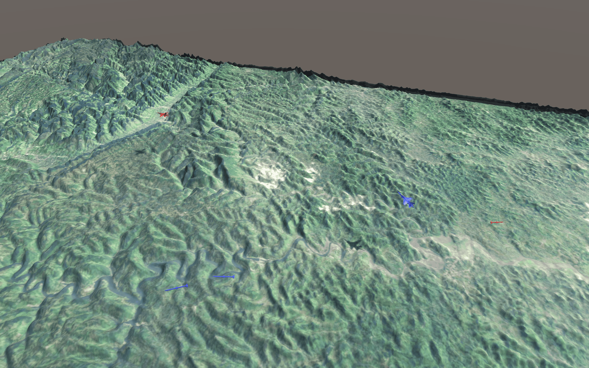
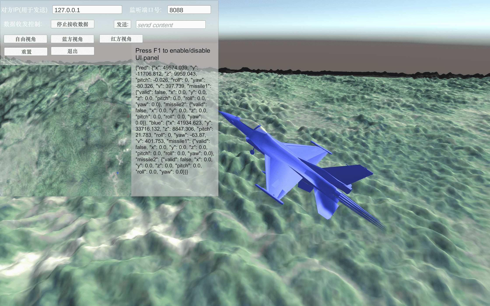
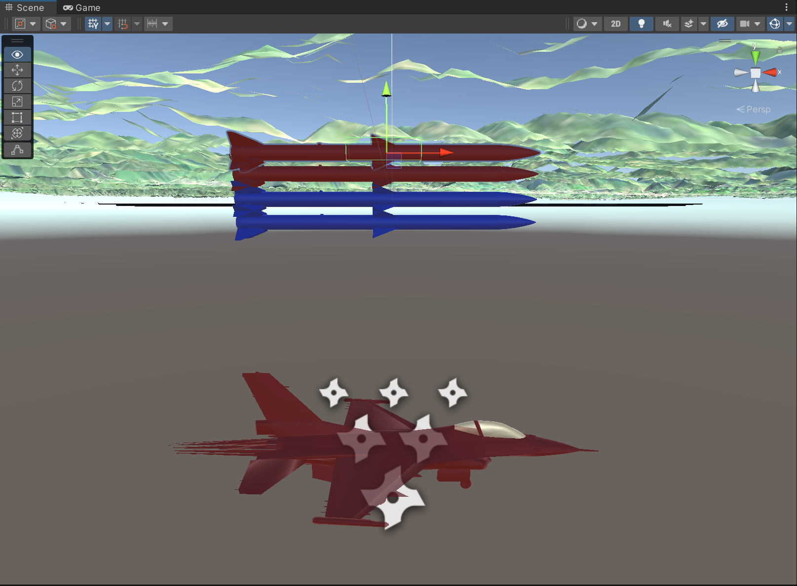
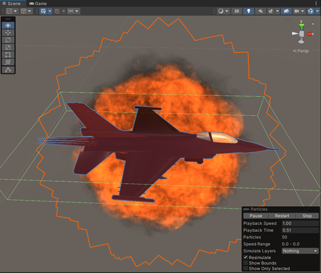

## FlightDisplay

FlightDisplay是一个十分简单的红蓝飞机对抗可视化软件，基于Unity 3D开发，其中红方和蓝方各携带两枚导弹。  

* Unity版本：2021.3.12f1c2
* Unity Hub版本： V3.3.0-c6
* 操作系统：Windows 11

基本效果如下：  

自由视角：  
  

蓝方视角：  
  

支持双方各两枚导弹：  


飞行器导弹碰撞检测，碰撞后飞行器爆炸，导弹消失：  



## 通信

使用 UDP 通信，通过 UI 面板填写监听端口号然后点击开始接收数据即可开启数据监听线程，之后周期性地向该端口发送飞机和导弹的姿态和位置信息即可。（对方IP号以及发送框用于调试，可以不填）  

为简单起见，通信格式为 Json，具体如下：  

``` json 
{
    "red": {
        "x": 1.0,
        "y": 1.0,
        "z": 1.0,
        "pitch": 1.0,
        "roll": 1.0,
        "yaw": 1.0,
        "v": 1.0,
        "missile1": {
            "valid": true,
            "x": 1.0,
            "y": 1.0,
            "z": 1.0,
            "pitch": 1.0,
            "roll": 1.0,
            "yaw": 1.0
        },
        "missile2": {
            "valid": true,
            "x": 1.0,
            "y": 1.0,
            "z": 1.0,
            "pitch": 1.0,
            "roll": 1.0,
            "yaw": 1.0
        }
    },
    "blue": {
        "x": 1.0,
        "y": 1.0,
        "z": 1.0,
        "pitch": 1.0,
        "roll": 1.0,
        "yaw": 1.0,
        "v": 1.0,
        "missile1": {
            "valid": true,
            "x": 1.0,
            "y": 1.0,
            "z": 1.0,
            "pitch": 1.0,
            "roll": 1.0,
            "yaw": 1.0
        },
        "missile2": {
            "valid": true,
            "x": 1.0,
            "y": 1.0,
            "z": 1.0,
            "pitch": 1.0,
            "roll": 1.0,
            "yaw": 1.0
        }
    }
}


```

